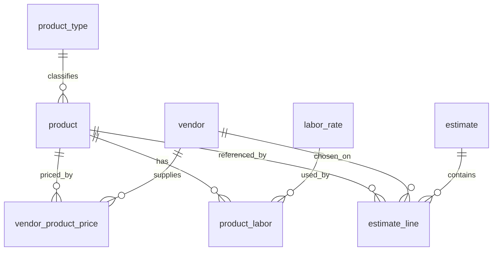

# Target Data Model — Product / Vendor-Price Catalog

A sketch of the "from scratch" model the estimator would use if it weren't
inheriting the legacy price list, plus an incremental, non-breaking path from
where we are today. Written 2026-08-06.

## The one idea

Every price in an estimate resolves through a **single path**:

```
estimate_line → product_id → product_type (how to calculate)
                          → vendor_product_price (what it costs, as-of a date)
```

No name-string matching. No hardcoded option arrays in module code. No
`calc_meta` blob per row. No "House built-in vs vendor label-override" trick.
A module renders *whatever products exist for its category*, and each product
carries its own calc rules and prices as data.

---

## Target schema

### Core catalog

**`product`** — the canonical catalog item (replaces `material_rates`' dual role)
- `id` uuid PK, `tenant_id`
- `product_type_id` → product_type (defines calc behavior + attribute schema)
- `category`, `subcategory` — the picker "marker", but FK-enforced against a taxonomy
- `name`, `unit`, `photo_url`, `is_active`, `show_in_selections`
- `attributes` jsonb — **validated against the product_type's schema** (this is
  today's `calc_meta` / `block_w/h/l_in`, but typed per product type)
- `default_unit_cost` — fallback only; real prices live in vendor_product_price

**`product_type`** — defines a *class* of products and how to price it
- `id`, `key` (e.g. `cmu_block`, `wall_finish`, `drain_pipe`, `turf_brand`)
- `attribute_schema` jsonb — which attributes are required/typed
  (e.g. wall_finish needs `unit` ∈ {SF,ton}, `labMode`, `waste`, `tonPerSF`)
- `calc_kind` — which calc routine the module uses for this type
- This is where "the type encodes calc behavior" lives **as data**, so Concrete
  tiers, Turf base, and finishes stop being special cases.

### Vendors + pricing

**`vendor`** — (today's `subs_vendors`, cleaned)
- `id`, `tenant_id`, `company_name`, contact fields, `supplied_categories`

**`vendor_product_price`** — the SKU + dated price (generalizes `material_price_history`)
- `id`, `product_id` → product, `vendor_id` → vendor (**null = Unspecified/House baseline**)
- `vendor_sku`, `unit_cost`
- `effective_start`, `effective_end`, `source` (`manual|price_sheet|invoice`), `import_id`
- Resolving a price = "the row for this product + vendor whose date range covers
  the estimate's as-of date." This is exactly the Phase-4 ledger, made primary.

### Labor (fixes the name-convention + Drainage disconnect)

**`labor_rate`** — `id`, `tenant_id`, `code`, `category`, `unit`, `rate`
**`product_labor`** — `product_id` → `labor_rate_id` + `coefficient`
- A product's labor is a **foreign key**, not a `"<name> - Labor Rate"` string
  lookup. The calc reads the linked rate, so editing it always flows through
  (kills the current bug where built-in Drainage labor edits are ignored).

### Estimate side

**`estimate_line`**
- `product_id` → product, `vendor_id` (nullable), `qty`, plus per-line inputs
- `unit_cost_snapshot`, `labor_snapshot` — captured at save so a reopened
  estimate is deterministic **without** carrying the whole `materialRows` blob
- as-of date on the estimate resolves live prices when desired

---

## ER sketch



---

## How today's workarounds map in

| Today (workaround) | Target (clean) |
|---|---|
| Name-string matching (`resolveMaterialPrice`) | `estimate_line.product_id` FK |
| `sub_category` marker | `product.subcategory` FK to taxonomy — same behavior, enforced |
| Hardcoded arrays (TURF_BRANDS, PIPE_TYPES, WF_META) merged with DB rows | Seeded `product` rows; modules render from DB only — no merge |
| `calc_meta` untyped JSON on every row | `product.attributes` validated by `product_type.attribute_schema` |
| `"<item> - Labor Rate"` name convention | `product_labor` FK to `labor_rate` |
| Built-in Drainage labor ignored by calc (bug) | Labor is a FK the calc always reads |
| `material_price_history` (secondary ledger) | `vendor_product_price` (primary price source) |
| `materialRows` snapshot saved into each estimate | `unit_cost_snapshot` per line + as-of resolution |
| Concrete / Turf-base / finishes special-cased | Ordinary `product_type`s with calc rules as data |

---

## Migration path (incremental, non-breaking)

Each phase ships on its own and is reversible; nothing is a big-bang rewrite.

**Phase 0 — bridge (DONE).** `sub_category` marker + `calc_meta` + shared
resolver. This is deliberately shaped like the target, so the later phases are
mostly "promote the bridge to first-class," not "rip and replace."

**Phase 1 — product_type + typed attributes.** Add `product_type`, classify
existing `material_rates` rows into types, move `calc_meta`/dimension columns
into validated `attributes`. Additive; no behavior change.

**Phase 2 — vendor_product_price as the price source.** Backfill it from
`material_price_history` + current `unit_cost`s. Point the resolver at it. The
Phase-4 as-of code already does most of this.

**Phase 3 — estimate_line by id.** Convert saved estimates from name/snapshot to
`product_id` references, backfilling by name→id match (same technique already
used for the Paver label→id remap). Capture `unit_cost_snapshot` per line.

**Phase 4 — retire the code built-ins.** Seed TURF_BRANDS / PIPE_TYPES / WF_META /
CMU blocks as `product` rows (they already have the attributes), then delete the
hardcoded arrays and the merge logic. Modules render purely from the catalog.

**Phase 5 — labor FKs.** Introduce `product_labor`; convert the name-keyed modules
(Columns, Finishes, Planting, Irrigation) to product references; fix the Drainage
labor disconnect as a side effect.

**Phase 6 — drop legacy.** Remove `material_rates` legacy columns, the
name-matching code paths, and `materialRows` snapshots.

---

## What it buys vs. costs

**Buys:** one resolution path; rename-safe references; a single source of truth
for built-ins; validated calc metadata; correct, always-applied labor; clean
as-of pricing; and — the original goal — *every* picker becomes "add a product,
it appears," with no per-module special cases left (Concrete, Turf-base,
finishes included).

**Costs:** Phases 1–3 are the real lift (schema + a careful estimate-data
backfill with parity checks against saved totals). Phases 4–6 are mostly deletion
once the foundation holds. Biggest risk is the estimate-line backfill (Phase 3);
mitigate with a parity harness that recomputes old estimates both ways and diffs
the totals — the same approach used for the Formulas engine port.

**Net:** we're ~one-third of the way there conceptually. The marker + calc_meta
work wasn't throwaway — it's the bridge, and it makes the remaining phases
promotions rather than rewrites.
